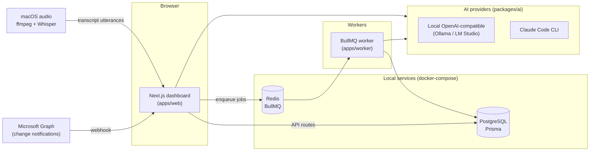

# Teams Discovery Observer

A local-first TypeScript monorepo with two cooperating pillars:

1. **Teams discovery & quoting** — ingests *explicitly approved* Microsoft Teams channels/chats via Microsoft Graph, normalizes and stores messages as evidence, summarizes threads, extracts requirement cards, and lets you ask questions over the collected context.
2. **Provider-agnostic live meeting assistant** — listens to local macOS audio (microphone + system/loopback), transcribes it locally with Whisper, shows a live transcript, and surfaces private "assist now" cards (likely questions for you, action items, suggested replies). Works with **any** meeting provider (Teams, Google Meet, Zoom, browser calls) because it captures audio off the machine, not provider APIs.

Both pillars run locally by default. Reasoning uses a local OpenAI-compatible model or the Claude Code CLI; transcription uses a local Whisper build. Nothing leaves the machine unless you point a provider at a remote endpoint.

## Architecture at a glance



See [docs/architecture.md](docs/architecture.md) for the full module map, data model, and runtime topology.

## Monorepo layout

| Workspace | Package | Responsibility |
|---|---|---|
| `apps/web` | `@teams-observer/web` | Next.js App Router dashboard + API routes (ingestion, agent, export, meetings, capture control). |
| `apps/worker` | `@teams-observer/worker` | BullMQ worker: Graph notification processing, thread summarization, requirement extraction, subscription renewal. |
| `apps/meeting-capture` | `@teams-observer/meeting-capture` | Standalone CLI capture companion (alternative to the server-managed capture). |
| `packages/core` | `@teams-observer/core` | Domain schemas/types, queue names, monitoring policy, HTML sanitization, security helpers, meeting-assist heuristics. |
| `packages/graph` | `@teams-observer/graph` | Microsoft Graph client, Teams resource/subscription helpers, message normalization. |
| `packages/ai` | `@teams-observer/ai` | AI provider contract, local OpenAI + Claude Code CLI providers, prompt templates. |
| `packages/db` | `@teams-observer/db` | Prisma client singleton and exports. |

## Quickstart

**Prerequisites:** Node 20+, npm, Docker (for Postgres + Redis).

```bash
make install            # npm install
make services-up        # docker compose up -d  (Postgres + Redis)
cp .env.example .env     # then edit as needed
make db-generate        # prisma generate
make db-migrate         # prisma migrate dev
make dev-web            # Next.js dashboard at http://localhost:3000
make dev-worker         # BullMQ worker (separate terminal)
```

The equivalent npm scripts are `npm install`, `docker compose up -d`, `npm run db:generate`, `npm run db:migrate`, `npm run dev:web`, `npm run dev:worker`.

### Verification set

There is no lint script; the verification set is:

```bash
make verify             # typecheck + test + build
# or individually:
npm run typecheck
npm test
npm run build
```

### Meeting assistant extras (macOS)

The live meeting assistant needs local audio tooling:

- **ffmpeg** — audio capture (`brew install ffmpeg`).
- **whisper-cli** (whisper.cpp) — local transcription (`brew install whisper-cpp`).
- **A Whisper model** — defaults to `~/.cache/teams-discovery-observer/models/ggml-tiny.en.bin`.
- **BlackHole** (loopback) — to caption audio playing *out* of your Mac (`brew install --cask blackhole-2ch`), routed through a macOS **Multi-Output Device** so you can hear and capture at once.

Full setup and the capture pipeline are documented in [docs/features/meeting-assistant.md](docs/features/meeting-assistant.md).

## Documentation

- [Architecture](docs/architecture.md) — modules, data model, runtime topology, system workflow.
- [Meeting assistant](docs/features/meeting-assistant.md) — local capture, VAD chunking, interim transcripts, assist cards.
- [Teams ingestion & quoting](docs/features/teams-ingestion.md) — Graph subscriptions, webhook, summarization, requirements.
- [AI & providers](docs/features/ai-and-providers.md) — provider contract, selection, ask-agent flow.
- [CLAUDE.md](CLAUDE.md) — contributor/agent guidance and operating principles.

## Configuration

All runtime config comes from environment variables (see [.env.example](.env.example)). Key groups:

- **Datastores:** `DATABASE_URL`, `REDIS_URL`.
- **Microsoft Graph (optional):** `AZURE_TENANT_ID`, `AZURE_CLIENT_ID`, `AZURE_CLIENT_SECRET`, `GRAPH_CLIENT_STATE`, `GRAPH_WEBHOOK_URL`, `AZURE_REDIRECT_URI`, `GRAPH_DELEGATED_SCOPES`.
- **Local AI:** `LOCAL_AI_BASE_URL`, `LOCAL_AI_MODEL`, `LOCAL_AI_API_KEY`.
- **Claude Code CLI:** `CLAUDE_CODE_COMMAND`, `CLAUDE_CODE_WORKDIR`, `CLAUDE_CODE_TIMEOUT_MS`.
- **Meeting capture (CLI):** `MEETING_CAPTURE_FFMPEG_FORMAT`, `MEETING_CAPTURE_MIC_INPUT`, `MEETING_CAPTURE_MEETING_INPUT`, `MEETING_CAPTURE_TRANSCRIBE_COMMAND`, `MEETING_CAPTURE_WHISPER_MODEL`, `MEETING_CAPTURE_SILENCE_MAX_DB`.

## Privacy & policy boundaries

- **Teams ingestion requires explicit per-source approval.** All ingestion passes through `assertSourceCanIngest`; the app never monitors tenant-wide Teams data implicitly.
- **Meeting audio is processed locally.** Raw audio chunks are temporary and deleted right after transcription; assist cards stay in the local dashboard.
- **Local-first by default.** Cloud/Claude use is opt-in via provider selection.
