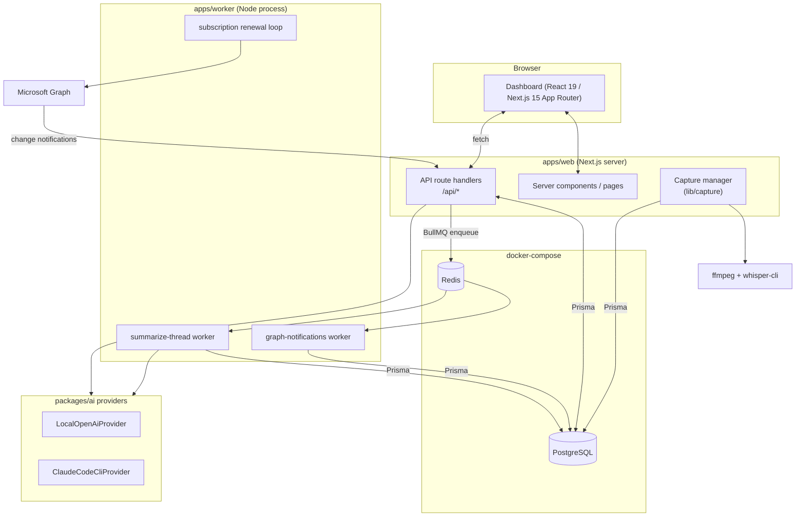
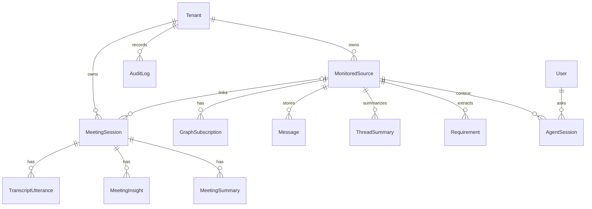

# Architecture

Teams Discovery Observer is an npm-workspaces TypeScript monorepo. It is **local-first**: the web app, worker, database, queue, transcription, and (optionally) the LLM all run on the developer's machine.

## Runtime topology

## Module map

### Apps

- **`apps/web`** — Next.js App Router. Two responsibilities:
  - **Dashboard pages** under `src/app/(dashboard)/`: `/` (overview), `/sources`, `/chats/[sourceId]`, `/threads`, `/requirements`, `/agent`, `/export`, `/meetings`, `/meetings/[meetingId]`.
  - **API routes** under `src/app/api/`: Graph (`/graph/auth/*`, `/graph/chats`, `/graph/subscriptions`, `/graph/webhook`), `/sources`, `/requirements`, `/agent/ask`, `/export`, and the meeting endpoints (`/meetings`, `/meetings/[id]`, `/meetings/[id]/utterances`, `/meetings/[id]/capture`, `/meetings/devices`).
  - Server-side helpers in `src/lib/`: `queues.ts` (BullMQ producers), `graph.ts` (Graph setup), `tenant.ts` (default tenant), `meeting-insights.ts` (deterministic assist detection), and `capture/` (server-managed audio capture).
- **`apps/worker`** — long-running Node process. Registers BullMQ workers (`graph-notifications`, `summarize-thread`) and runs a 5-minute subscription-renewal loop. Entry: `src/index.ts`.
- **`apps/meeting-capture`** — standalone CLI capture companion (`tsx src/index.ts`). An alternative to the server-managed capture for headless/manual use.

### Packages

- **`packages/core`** — framework-agnostic domain layer:
  - `domain/` schemas & types: `sources`, `messages`, `requirements`, `agent`, `meetings` (+ `meetings.test.ts`).
  - `policies/monitoring.ts` — `assertSourceCanIngest` ingestion guard.
  - `queues.ts` — queue names + job payload types.
  - `sanitize.ts` — HTML sanitization for untrusted Teams content.
  - `security.ts` — security helpers (e.g. client-state hashing/compare).
- **`packages/graph`** — Microsoft Graph integration: `client.ts`, `resources.ts`, `subscriptions.ts`, `normalize.ts` (Graph chat message → normalized `Message`).
- **`packages/ai`** — `provider.ts` (the `AiProvider` contract), `factory.ts` (provider selection), `providers/local-openai.ts`, `providers/claude-code-cli.ts`, `prompts/` (summarize, requirements, answer, context), `json.ts` (robust JSON parsing of model output).
- **`packages/db`** — Prisma client singleton (`prisma`) and re-exports.

## Data model

Canonical schema: [`prisma/schema.prisma`](../prisma/schema.prisma).

Two domains share the same database:

- **Discovery domain:** `Tenant`, `User`, `ConsentGrant`, `MonitoredSource`, `GraphSubscription`, `Message`, `ThreadSummary`, `Requirement`, `AgentSession`.
- **Meeting domain:** `MeetingSession`, `TranscriptUtterance`, `MeetingInsight`, `MeetingSummary`.
- **Cross-cutting:** `AuditLog` (started/ended meetings, ingestion events).

`ThreadSummary`, `Requirement`, and `AgentSession` all retain `evidenceMessageIds` so AI outputs trace back to the Teams messages that justified them.

## Job queues

Defined in `packages/core/src/queues.ts`, produced by `apps/web/src/lib/queues.ts`, consumed by `apps/worker`:

| Queue | Payload | Producer | Consumer |
|---|---|---|---|
| `graph-notifications` | `GraphNotificationJobData` | Graph webhook route | `process-graph-notification.ts` |
| `summarize-thread` | `SummarizeThreadJobData` | after a message is upserted | `summarize-thread.ts` |
| `renew-subscriptions` | (timer-driven) | worker interval | `renew-graph-subscriptions.ts` |

> Note: meeting transcription does **not** use the queue. The capture manager writes `TranscriptUtterance` rows and deterministic `MeetingInsight` rows synchronously in `apps/web`. See [meeting-assistant.md](features/meeting-assistant.md).

## Verification

No lint script is configured. The verification set is `npm run typecheck`, `npm test` (Vitest), and `npm run build` — combined as `make verify`.
