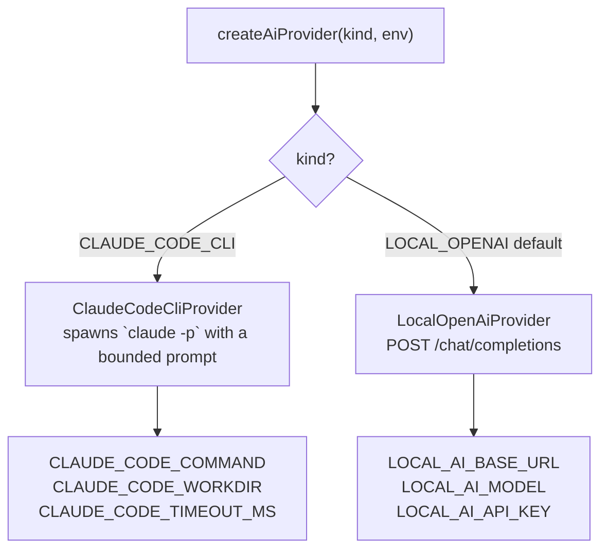
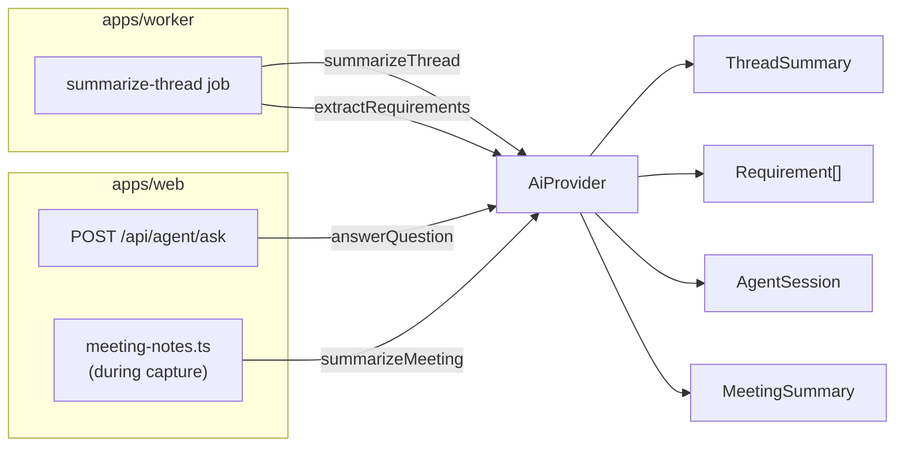

# AI & Providers

All model-backed work goes through a single provider contract so the rest of the app never hard-codes a vendor. Two providers are shipped, both runnable locally. Used by Teams summarization/requirements/agent and by the meeting assistant's opt-in rolling notes. The real-time meeting assist **cards** stay deterministic (no model call).

## Provider contract

Defined in `packages/ai/src/provider.ts`:

```ts
type AiProvider = {
  kind: "LOCAL_OPENAI" | "CLAUDE_CODE_CLI";
  model: string;
  summarizeThread(input: AgentContextBundle): Promise<ThreadSummaryResult>;
  extractRequirements(input: AgentContextBundle): Promise<RequirementExtractionResult>;
  answerQuestion(input: AgentContextBundle & { question: string }): Promise<AgentAnswer>;
  summarizeMeeting(input: MeetingNotesContext): Promise<MeetingNotesResult>;
};
```

`summarizeMeeting` takes a `MeetingNotesContext` (the meeting title + a speaker-labelled transcript) and returns `{ summary, openQuestions, actionItems }` — the rolling meeting notes. See [meeting-assistant.md](meeting-assistant.md).

`AgentContextBundle` carries the retrieved evidence (recent messages, summaries, non-rejected requirements). Prompt templates in `packages/ai/src/prompts/` treat Teams content as **untrusted evidence** and require message-id citations; `packages/ai/src/json.ts` robustly parses model output.

## Provider selection

`createAiProvider(kind, env)` in `packages/ai/src/factory.ts`:



- **`LOCAL_OPENAI`** (default) — calls a local OpenAI-compatible `/chat/completions` endpoint such as Ollama or LM Studio (`LOCAL_AI_BASE_URL`, defaults to `http://localhost:11434/v1`, model `llama3.1`).
- **`CLAUDE_CODE_CLI`** — spawns the local Claude Code CLI (`claude -p`) with a bounded prompt and timeout. Best for slower, higher-quality tasks.

The `AiProviderKind` is persisted on the rows an inference produces (`ThreadSummary.provider`, `Requirement.provider`, `AgentSession.provider`, `MeetingSummary.provider`), so every output records which model made it.

## Where it's used



### Summarization & extraction (worker)

`apps/worker/src/jobs/summarize-thread.ts` builds the evidence bundle for a thread, calls `summarizeThread` then `extractRequirements`, and writes a `ThreadSummary` plus `Requirement` rows (both with `evidenceMessageIds`). See [teams-ingestion.md](teams-ingestion.md).

### Ask-agent (web)

`apps/web/src/app/api/agent/ask/route.ts` (UI: `AgentConsole`, page `/agent`) retrieves recent messages, summaries, and non-rejected requirements, calls `answerQuestion`, and stores an `AgentSession` with the question, answer, provider/model, and evidence ids. The provider is chosen per request (the console exposes the selection).

### Meeting notes (web)

When enabled (`MEETING_NOTES=true`), `apps/web/src/lib/meeting-notes.ts` summarizes the transcript during the meeting. It is fire-and-forget off the capture path, throttled per meeting, and upserts a single rolling `MeetingSummary` via `summarizeMeeting`. Provider chosen with `MEETING_NOTES_PROVIDER` (default `LOCAL_OPENAI`). See [meeting-assistant.md](meeting-assistant.md).

## What stays off the provider

- The live assist **cards** do **not** call a provider — `detectMeetingAssistInsights` (`packages/core/src/domain/meetings.ts`) is pure pattern logic, keeping them fast and fully local.
- Speaker **diarization** uses a local ONNX voice-embedding model (run via onnxruntime), not this provider contract — only the clustering is deterministic code.

Both are described in [meeting-assistant.md](meeting-assistant.md).

## Configuration summary

| Provider | Env vars |
|---|---|
| `LOCAL_OPENAI` | `LOCAL_AI_BASE_URL`, `LOCAL_AI_MODEL`, `LOCAL_AI_API_KEY` |
| `CLAUDE_CODE_CLI` | `CLAUDE_CODE_COMMAND`, `CLAUDE_CODE_WORKDIR`, `CLAUDE_CODE_TIMEOUT_MS` |
