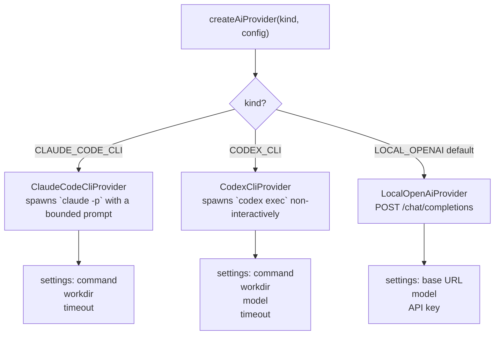
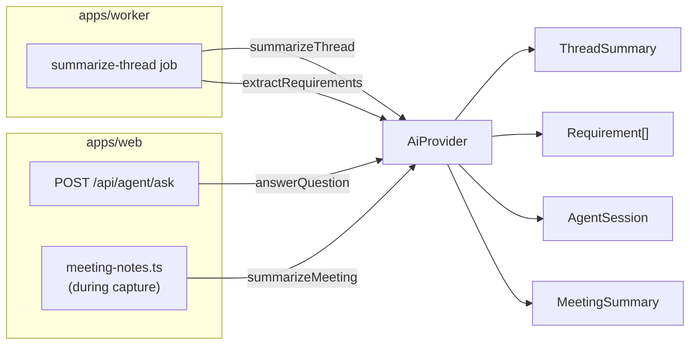

# AI & Providers

All model-backed work goes through a single provider contract so the rest of the app never hard-codes a vendor. Three providers are shipped, all runnable locally. Used by Teams summarization/requirements/agent and by the meeting assistant's opt-in rolling notes. The real-time meeting assist **cards** stay deterministic (no model call).

## Provider contract

Defined in `packages/ai/src/provider.ts`:

```ts
type AiProvider = {
  kind: "LOCAL_OPENAI" | "CLAUDE_CODE_CLI" | "CODEX_CLI";
  model: string;
  summarizeThread(input: AgentContextBundle): Promise<ThreadSummaryResult>;
  extractRequirements(input: AgentContextBundle): Promise<RequirementExtractionResult>;
  answerQuestion(input: AgentContextBundle & { question: string }): Promise<AgentAnswer>;
  summarizeMeeting(input: MeetingNotesContext): Promise<MeetingNotesResult>;
};
```

`prepareMeetingContext` takes pasted/upload-extracted meeting context before capture starts and returns a private briefing, agenda items, open questions, risks, and keywords. `summarizeMeeting` takes a `MeetingNotesContext` (the meeting title + optional prepared context + a speaker-labelled transcript) and returns `{ summary, openQuestions, actionItems }` — the rolling meeting notes. See [meeting-assistant.md](meeting-assistant.md).

`AgentContextBundle` carries the retrieved evidence (recent messages, summaries, non-rejected requirements). Prompt templates in `packages/ai/src/prompts/` treat Teams content as **untrusted evidence** and require message-id citations; `packages/ai/src/json.ts` robustly parses model output.

## Provider selection

`createAiProvider(kind, config)` in `packages/ai/src/factory.ts`:



- **`LOCAL_OPENAI`** (default) — calls a local OpenAI-compatible `/chat/completions` endpoint such as Ollama or LM Studio. Defaults: base URL `http://localhost:11434/v1`, model `llama3.1`.
- **`CLAUDE_CODE_CLI`** — spawns the local Claude Code CLI (`claude -p`) with a bounded prompt and timeout. Best for slower, higher-quality tasks.
- **`CODEX_CLI`** — spawns `codex exec` with `approval_policy="never"`, read-only sandboxing, `--skip-git-repo-check`, `--ephemeral`, and `--output-last-message`. Prompt text is passed over stdin.

## Provider settings

The `/settings` dashboard page stores tenant-wide provider defaults in Postgres (`AiProviderSettings`):

- Teams summarization and requirement extraction.
- Ask agent.
- Pre-meeting context preparation, when agenda/context is supplied.
- Rolling meeting notes, when enabled on `/settings`.

The settings row also stores shared provider config for the local OpenAI-compatible endpoint, Claude Code CLI, and Codex CLI. A local API key saved from the page is encrypted with `SETTINGS_ENCRYPTION_KEY`; decrypted secrets are never returned to the UI, which only shows whether a key exists. If there is no settings row, feature execution falls back to hard-coded local defaults: each feature uses `LOCAL_OPENAI`, local base URL `http://localhost:11434/v1`, model `llama3.1`, CLI commands `claude`/`codex`, and 120s timeouts.

The `AiProviderKind` is persisted on the rows an inference produces (`ThreadSummary.provider`, `Requirement.provider`, `AgentSession.provider`, `MeetingSummary.provider`), so every output records which model made it.

## Where it's used



### Summarization & extraction (worker)

`apps/worker/src/jobs/summarize-thread.ts` builds the evidence bundle for a thread, calls `summarizeThread` then `extractRequirements`, and writes a `ThreadSummary` plus `Requirement` rows (both with `evidenceMessageIds`). See [teams-ingestion.md](teams-ingestion.md).

### Ask-agent (web)

`apps/web/src/app/api/agent/ask/route.ts` (UI: `AgentConsole`, page `/agent`) retrieves recent messages, summaries, and non-rejected requirements, resolves the configured Ask agent provider, calls `answerQuestion`, and stores an `AgentSession` with the question, answer, provider/model, and evidence ids.

### Meeting notes (web)

When agenda/context is supplied, `apps/web/src/lib/meeting-context.ts` extracts pasted text or text/PDF uploads, discards uploaded bytes, and calls the configured Meeting notes provider once via `prepareMeetingContext`. When enabled on `/settings`, `apps/web/src/lib/meeting-notes.ts` summarizes the transcript during the meeting. It is fire-and-forget off the capture path, throttled per meeting, resolves the configured Meeting notes provider, and upserts a single rolling `MeetingSummary` via `summarizeMeeting`. See [meeting-assistant.md](meeting-assistant.md).

## What stays off the provider

- The live assist **cards** do **not** call a provider — `detectMeetingAssistInsights` (`packages/core/src/domain/meetings.ts`) is pure pattern logic, keeping them fast and fully local.
- Speaker **diarization** uses a local ONNX voice-embedding model (run via onnxruntime), not this provider contract — only the clustering is deterministic code.

Both are described in [meeting-assistant.md](meeting-assistant.md).

## Configuration summary

Provider runtime settings and meeting feature toggles (rolling notes, diarization, transcript correction) live in `/settings`, not env. Env is still used for infrastructure (`DATABASE_URL`, `REDIS_URL`, Graph credentials), `SETTINGS_ENCRYPTION_KEY`, and per-machine capture tuning.
