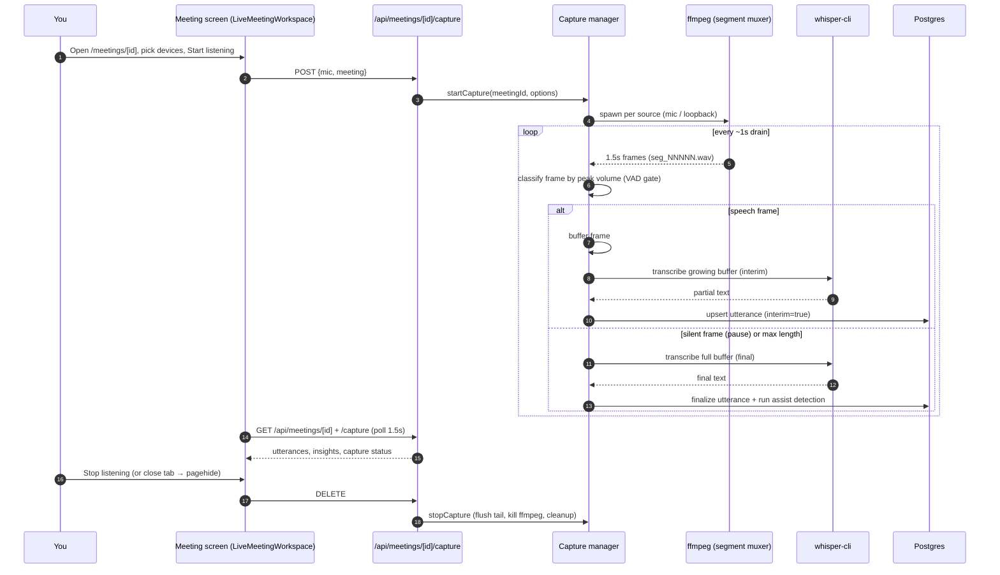
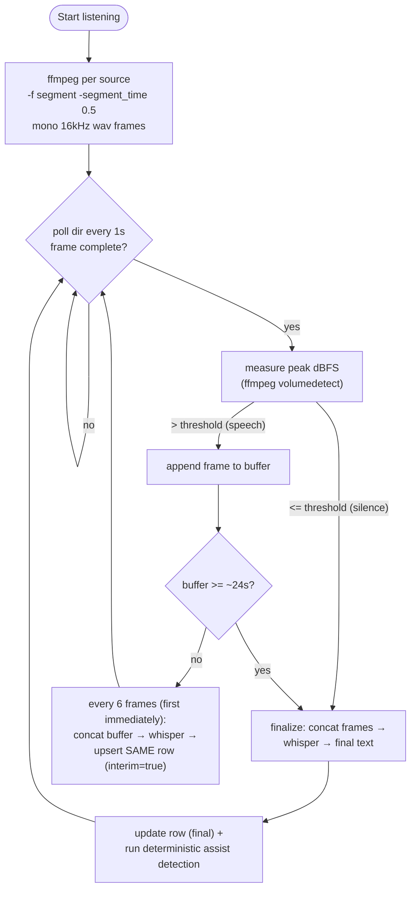
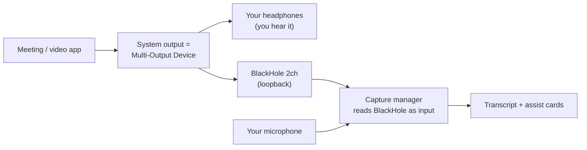

# Meeting Assistant

A provider-agnostic, local-first live meeting assistant. It captures audio playing on the machine, transcribes it locally with Whisper, shows a live transcript, and surfaces private "assist now" cards — without depending on any meeting provider's API, bot, or recording feature.

Because it captures **local audio** (microphone + system/loopback), it works with Microsoft Teams, Google Meet, Zoom, browser calls, or a played-back recording all the same.

## Concepts

| Concept | Meaning |
|---|---|
| **MeetingSession** | One sitting. `ACTIVE` while in progress, `ENDED` after. Has a provider label and optional context id. |
| **TranscriptUtterance** | One transcribed unit. `speakerRole` = `SELF` (your mic) / `OTHER` (others) / `UNKNOWN`; `sourceChannel` = `MIC` / `LOOPBACK` / `MIXED` / `IMPORTED`. |
| **MeetingInsight** | A deterministic assist card: `QUESTION_FOR_YOU`, `ANSWER_SUGGESTION`, `ACTION_ITEM`, `NAME_MENTION`, `NOTE`. |
| **MeetingSummary** | Reserved for end-of-meeting summaries (open questions / action items). |

## Capture: two paths

1. **Server-managed capture (default).** The Next.js server spawns and supervises ffmpeg + Whisper and writes utterances directly. Driven from the meeting screen ("Listening controls"). Code: `apps/web/src/lib/capture/manager.ts`, `apps/web/src/lib/capture/devices.ts`.
2. **CLI companion (`apps/meeting-capture`).** A standalone `tsx` CLI for headless/manual capture. Uses fixed-interval chunking (does not do the VAD/interim pipeline below). Commands: `check`, `devices`, `create-session`, `send-text`, `capture-once`, `capture-loop`, `capture-live`.

The rest of this document describes the **server-managed** pipeline.

## End-to-end workflow

## Capture pipeline internals

The core idea is **VAD-style (pause-delimited) segmentation with interim results**, the documented best practice for streaming Whisper. Fixed-time cuts split sentences mid-flow; cutting on pauses keeps them whole, and interim re-transcription keeps latency low.

Key parameters (in `apps/web/src/lib/capture/manager.ts`):

- `FRAME_SECONDS = 0.5` — VAD resolution; ffmpeg `segment` muxer frame length. Kept small so a frame can land entirely inside a natural inter-sentence pause (median ~0.5s in real meetings); larger frames miss those pauses and let the 24s cap chop sentences mid-clause.
- `MAX_UTTERANCE_FRAMES` — force-flush a long monologue at ~24s so latency stays bounded.
- `INTERIM_EVERY_FRAMES = 6` — re-transcribe cadence (~3s); the first speech frame always shows immediately.
- `MEETING_CAPTURE_SILENCE_MAX_DB` (default `-45`) — peak-volume floor below which a frame is treated as silence. Doubles as the VAD threshold.
- Transcription: `whisper-cli -m <model> -f <wav> -nt -np`. Output is normalized to strip non-speech tags (`[...]`, `(...)`, `*...*`); empty results are skipped, so silence produces nothing. Output that `isLikelyHallucinatedTranscription` (in `packages/core`) flags as a stock Whisper silence-hallucination (e.g. `"Thank you."`, `"♪♪"` from a quiet mic) is also dropped as noise.

### Interim → final lifecycle

- While speech accumulates, the same `TranscriptUtterance` row is **updated in place** with progressively longer (and self-correcting) text, flagged `engineMetadata.interim = true`. The UI shows a pulsing **● REFINING** badge and a dashed bubble.
- On a pause (silent frame), max-length, or stop, the buffer is transcribed once more as the **final** text, the `interim` flag is cleared, and **assist detection runs once** on the complete text (avoids churning cards on partials). If that final text is empty or noise, any interim row already shown for it is **retracted** (deleted) rather than left stuck as "refining".
- Raw frame files are deleted as soon as they're consumed; nothing audio is persisted.

### Speaker diarization (others channel)

The mic channel is a single speaker (you → `SELF`). The **others** channel carries every remote participant, so each finalized utterance there is grouped into a stable per-meeting **Speaker N** identity:

- `apps/web/src/lib/capture/diarizer.ts` embeds the utterance audio with a local ONNX speaker model (`Xenova/wavlm-base-plus-sv`, run via `@huggingface/transformers`/onnxruntime, downloaded to the model cache on first use).
- `assignSpeaker` in `packages/core/src/domain/diarization.ts` does the grouping: cosine-compare the embedding to each existing speaker centroid, join the best match above the similarity threshold, else start a new speaker. Pure and deterministic — only the embedding is a model call.
- The label is stored on the utterance's `engineMetadata.speakerLabel` (no schema change) and shown in the transcript; `speakerKey` is the 1-based id.
- Accuracy is **approximate** — short turns and similar voices on mono 16 kHz audio can be mislabeled. Tuning: `MEETING_CAPTURE_DIARIZATION` (set `false` to disable), `MEETING_DIARIZATION_SIMILARITY_THRESHOLD` (default `0.86`; higher splits a speaker, lower merges speakers), `MEETING_DIARIZATION_MODEL`, `MEETING_DIARIZATION_MODEL_CACHE`. If the model fails to load, the utterance is still saved (just without a speaker label).

## Assist cards (deterministic)

`detectMeetingAssistInsights` in `packages/core/src/domain/meetings.ts` runs pattern checks on each finalized non-`SELF` utterance and emits cards via `apps/web/src/lib/meeting-insights.ts`:

- **QUESTION_FOR_YOU** + **ANSWER_SUGGESTION** — question patterns / `?`.
- **ACTION_ITEM** — phrases like "can you", "could you", "please", "you need to".
- **NAME_MENTION** — when your configured name appears.

These are code-driven (no model call) so they're fast and private. A local LLM pass (`analyzeMeetingWindow`) and end-of-meeting `MeetingSummary` generation are natural next steps.

## API surface

| Method & path | Purpose |
|---|---|
| `POST /api/meetings` | Create a session (`createMeetingSessionSchema`). |
| `GET /api/meetings` | List recent sessions. |
| `GET /api/meetings/[id]` | Session + utterances + insights + summaries (polled by the UI). |
| `PATCH /api/meetings/[id]` | End a session (`status: ENDED`), writes an audit log. |
| `POST /api/meetings/[id]/utterances` | Ingest a transcript utterance (`ingestTranscriptUtteranceSchema`); used by the CLI. |
| `GET/POST/DELETE /api/meetings/[id]/capture` | Capture status / start / stop (server-managed). |
| `GET /api/meetings/devices` | List macOS audio input devices (ffmpeg avfoundation). |

## UI (`LiveMeetingWorkspace`)

Polls `/api/meetings/[id]` and `/api/meetings/[id]/capture` every **1.5s**. Layout, top to bottom:

1. **Assist now** (wider) + **Meeting notes** — a 60/40 row; the actionable focus.
2. **Transcript stream** + **Summaries** — transcript is chronological (oldest top), auto-scrolls to the newest line, and shows the **refining** indicator on in-progress lines.
3. **Live caption** + **Listening controls** — device pickers (mic + system/loopback), Start/Stop, live status.

Behavioral notes:

- **No auto-start** — capture begins only when you click **Start listening**.
- **Device defaults** — the mic defaults to the built-in mic; the "Capture meeting audio from (others)" field auto-selects a detected loopback device (BlackHole/Aggregate/Multi-Output).
- **Inputs vs outputs** — the dropdowns list *capture inputs*. Your headphones/speakers are an *output*, set in macOS Sound, not here.
- **Auto-stop on close** — a `pagehide` handler stops this page's capture (via a `keepalive` DELETE) so a closed/reloaded tab doesn't keep capturing.

## macOS audio setup

A microphone cannot hear audio playing *out* of the computer. To caption meeting/video audio you need a **system-audio loopback** device.

1. `brew install ffmpeg whisper-cpp` and `brew install --cask blackhole-2ch`.
2. Provide a Whisper model at `~/.cache/teams-discovery-observer/models/ggml-tiny.en.bin` (or set `MEETING_CAPTURE_WHISPER_MODEL`).
3. In **Audio MIDI Setup**, create a **Multi-Output Device** containing your headphones **and** BlackHole 2ch; set your headphones as Primary and enable Drift Correction on BlackHole. Right-click it → **Use This Device For Sound Output**.
4. In the meeting screen, pick **BlackHole 2ch** as "Capture meeting audio from (others)" (auto-selected) and your mic, then **Start listening**.

## Privacy

- Audio is transcribed locally; **raw audio chunks are deleted immediately** after transcription.
- Assist cards are deterministic and stay in the local dashboard — no model call for the real-time path.
- Capture is explicit (manual Start) and tears down on Stop, page close, or session end.
