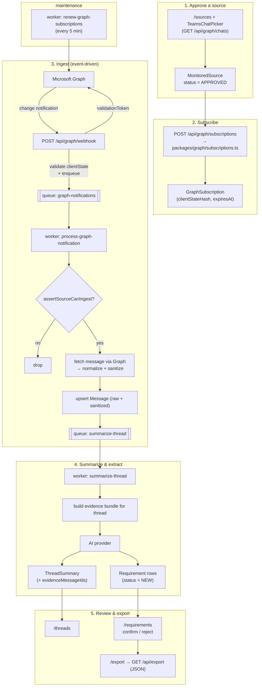

# Teams Ingestion & Quoting

Ingests *explicitly approved* Microsoft Teams channels/chats through Microsoft Graph, stores normalized messages as evidence, summarizes threads, extracts requirement cards, and exports quoting evidence. This pillar is optional — it activates only when Graph credentials are configured and a source is approved.

## Policy boundary

The defining rule: **ingestion requires explicit per-source approval.** A `MonitoredSource` must be `APPROVED`, and every ingestion path calls `assertSourceCanIngest` (`packages/core/src/policies/monitoring.ts`). The app never subscribes to tenant-wide Teams data implicitly. Teams content is treated as **untrusted** and is sanitized (`packages/core/src/sanitize.ts`) before storage/display.

## Workflow

## Stages

### 1. Authorize & approve

- **Delegated auth** (optional): `/api/graph/auth/start` → Microsoft consent → `/api/graph/auth/callback`, using `GRAPH_DELEGATED_SCOPES`.
- **Browse & approve**: the `/sources` page uses `TeamsChatPicker` (backed by `GET /api/graph/chats`) to pick a channel/chat and create a `MonitoredSource` with `status = APPROVED`.

### 2. Subscribe

`POST /api/graph/subscriptions` creates a Microsoft Graph change-notification subscription for the approved source (`packages/graph/src/subscriptions.ts`) and stores a `GraphSubscription` row with a hashed `clientState` and an `expiresAt`.

### 3. Webhook → queue

`POST /api/graph/webhook` (`apps/web/src/app/api/graph/webhook/route.ts`):

- Answers Graph's **validation handshake** (echoes `validationToken`).
- Validates the notification's `clientState` against the stored hash.
- Enqueues a `graph-notifications` job (`GraphNotificationJobData`).

### 4. Worker processing

- **`process-graph-notification.ts`**: re-validates `clientState`, finds the registered subscription, runs `assertSourceCanIngest`, fetches the message from Graph, **normalizes** (`packages/graph/src/normalize.ts`) and **sanitizes** it, upserts a `Message` (storing both sanitized text/HTML and raw Graph JSON), then enqueues `summarize-thread`.
- **`summarize-thread.ts`**: builds an evidence bundle for the thread, calls the selected AI provider to produce a `ThreadSummary`, then extracts requirement cards into `Requirement` rows (`status = NEW`). Both retain `evidenceMessageIds` for traceability. See [ai-and-providers.md](ai-and-providers.md).
- **`renew-graph-subscriptions.ts`**: runs on startup and every 5 minutes; renews subscriptions near expiry when Graph credentials are present.

### 5. Review & export

- `/threads` browses recent messages and their summaries.
- `/requirements` confirms or rejects extracted requirements (`ReviewStatus` `NEW` → `CONFIRMED` / `REJECTED`) via `POST /api/requirements`.
- `/export` (`GET /api/export`) produces a JSON evidence bundle for quoting, with message-id citations intact.

## Data touched

`MonitoredSource`, `GraphSubscription`, `Message`, `ThreadSummary`, `Requirement` — plus `AuditLog` entries. Field-level detail is in [`prisma/schema.prisma`](../../prisma/schema.prisma) and summarized in [architecture.md](../architecture.md#data-model).

## Configuration

Requires `AZURE_TENANT_ID`, `AZURE_CLIENT_ID`, `AZURE_CLIENT_SECRET`, `GRAPH_CLIENT_STATE`, and a publicly reachable `GRAPH_WEBHOOK_URL` for real webhook delivery. Delegated browsing also uses `AZURE_REDIRECT_URI` and `GRAPH_DELEGATED_SCOPES`. Without these, the discovery pillar stays dormant and the meeting assistant still works.
